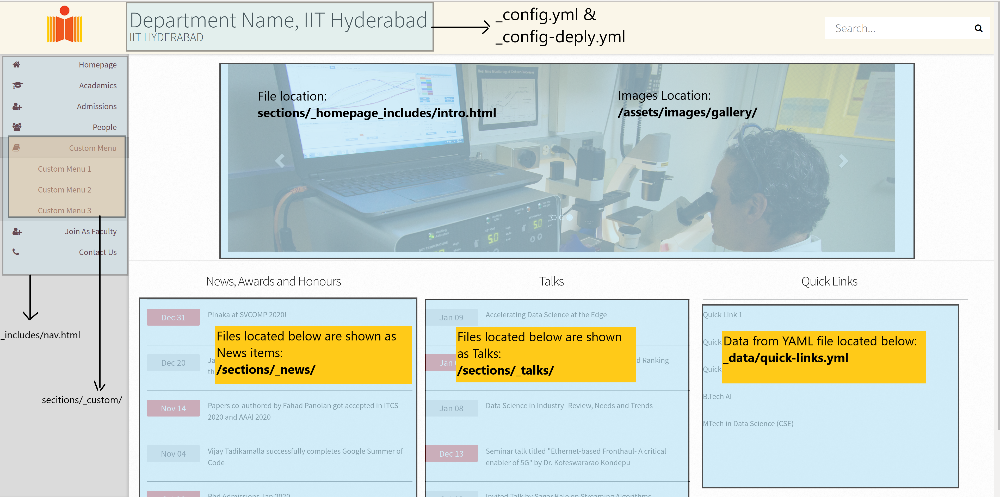

# Installing Jekyll on a Debian based system
## Preparation:
### Basic packages needed:
```
sudo apt update
sudo apt install git
sudo apt-get install ruby-full build-essential zlib1g-dev
```

### Configure bashrc to define new environment variables:
```
echo '# Install Ruby Gems to ~/gems' >> ~/.bashrc
echo 'export GEM_HOME="$HOME/gems"' >> ~/.bashrc
echo 'export PATH="$HOME/gems/bin:$PATH"' >> ~/.bashrc
source ~/.bashrc
```

### Install Jekyll as well as bundler:
```
gem install jekyll bundler
```
Check Jekyll's installed version by typing:
```
jekyll --version
```

### Obtain the latest template from git:
```
git clone https://gitlab.com/rtmiit/department-template.git
```

### Build the template:
Change to the new git directory and do:
```
bundle install
bundle exec jekyll serve
```

Copy the URL generated and paste it in your browser to view your website.


==========================================

# Installing Jekyll on a Windows system
## Preparation:

1. Download and Install a Ruby+Devkit version from [RubyInstaller Downloads](https://rubyinstaller.org/downloads/). Use default options for installation.
2. Run the ```ridk install``` step on the last stage of the installation wizard. This is needed for installing gems with native extensions.
3. Open a new command prompt window from the start menu, so that changes to the ```PATH``` environment variable becomes effective. Install Jekyll and Bundler via: ```gem install jekyll bundler```
4. Check if Jekyll installed properly: ```jekyll -v```

# Install Git on windows

1. Git for Windows stand-alone installer Download the latest [Git for Windows installer](https://git-for-windows.github.io/).
2. When you've successfully started the installer, you should see the Git Setup wizard screen. Follow the Next and Finish prompts to complete the installation. The default options are pretty sensible for most users.

### Obtain the latest template from git:

1. Create a new folder
2. Open command prompt and change to the newly created folder and follow the below commands

```
git clone https://gitlab.com/rtmiit/department-template.git
```

### Build the template:
Change to the new git directory and do:
```
bundle install
bundle exec jekyll serve
```

Copy the URL generated and paste it in your browser to view your website.


==========================================
## Creating website
  The front page of the website draws information from several different files. Some of the important ones are mentioned in following image.
  

### File formats
- Almost all data is stored in either a .yml file, or in a .md file.

- The .yml files store structured data like faculty information.

- The .md files store posts such as News items in MarkDown format.

  MarkDown is a very easy format to learn, and write. Please see [Markdown tutorial](https://www.markdowntutorial.com/) for a easy 10 minute guide to learning markdown. The .md files that you write are converted to plain html for display by Jekyll. 

### Title of Website

open **_config.yml** and **_config-deply.yml** files
Replace "Department Name" with the actual name. Eg: Computer Science & Engineering

### Left Menu
Open **nav.html** inside folder "_includes"
1. Each menu item is called as collection.
2. Menu item is two types.
  1. Direct link to a page (E.g: Join as Faculty and Contact Us)
  2. Drop Down menu (E.g: Academics, Admissions and etc)
3. To add as a Direct Link Menu item:
  1. ```<li><a href="{{ 'facultyJoin.html' | absolute_url }}" class="single"><i class="fa fa-user-plus"></i>Join As Faculty</a></li>```
  2. Replace ```facultyJoin.html``` in the above code with the page you created and change ```Join As Faculty``` to the title of the page.
  3. Even if the file name is ```facultyJoin.md```, you need to type as ```facultyJoin.html```.
  4. In the front matter specify the order of the menu item as ```order: 10``` (This is given in Contact-Us page)
4. To add as Drop Down Menu item
  1. Copy the below code
```
<li>
<button class="
 dropdown-btn
 
 dropdownactive
 ">
 <i class="fa fa-book"></i>Custom Menu
</button>
<div class="dropdown-tabs"
 
 style="display:block"
 >
 
 
 <a href="{{ subsection.url | absolute_url }}">{{ subsection.title }}</a>
 
 
</div>
</li>
```
  2. Replace word "**custom**" with the name of the menu item.
  3. Create a folder starting with underscore (Eg: _custom) in the folder "**sections**"
  4. Start creating pages inside that folder, which will automatically will become Sub Menu items.


### Slides

1. For faster loading of website we are limited to three slides with lower file size.
2. To replace these slides.
  1. Save your images for slider in the location ``/assets/images/gallery/``
  2. Open file **intro.html** located in ```/sections/_homepage_includes/```
  3. Replace the names of the images such as  slide_1.jpg, slide_2.jpg and slide_3.jpg with the names of your images.
  4. For better SEO Optimization (i.e. Google Search results) replace ``Alt`` with the small description of image (i.e. replace First slide with a three word information of picture).

### News, Talks and Quick Links

### **News, Awards and Honours**

1. This list will automatically displays the latest information based on date which are saved in the location ``/sections/_news/``
2. Create a post with the Markdown Post Format (i.e. 2020-03-14-title-of-the-news.md) in the above mentioned location.
3. It will be automatically shown on Homepage.
4. This post's front matter should be like below  
``    ---``  
``    title: Title of the post``  
``    layout: post``  
``    ---``
5. The default number of News items are limited to 5. This can be changed in ``/sections/_homepage_includes/news_talks.html``. Change the line ``forloop.index == 5`` (under the News, Awards and Honours div) with the required number.
6. The hyperlink "See All" is configured to link to another page which lists all the news items.

### **Talks**

1. This list will automatically displays the latest information based on date which are saved in the location ``/sections/_talks/``
2. Create a post with the Markdown Post Format (i.e. 2020-03-14-title-of-the-talk.md) in the above mentioned location.
3. It will be automatically shown on Homepage.
4. This post's front matter should be like below  
``    ---``  
``    title: Title of the post``  
``    layout: post``  
``    ---``
5. The default number of Talks items are limited to 5. This can be changed in ``/sections/_homepage_includes/news_talks.html``. Change the line ``forloop.index == 5`` (under the Talks div) with the required number.
6. The hyperlink "See All" is configured to link to another page which lists all Talks.
7. Format of the Talk page is of your interest. The format provided usually suffices.

### **Quick Links**

1. This list automatically displays from the file ``/_data/quick-links.yml``
3. When any external link is to be placed under Quick Links, add extra item named ``direct: true``
4. Default number of Quick Links are limited to 5. his can be changed in ``/sections/_homepage_includes/news_talks.html``. Change the line ``forloop.index == 5`` (under the Quick Links div) with the required number.

### **Curriculum**

1. Open file curriculum.md located in ``/sections/_academics/``
2. Files regarding curriculum are displayed here.
3. These files are stored in ``/assets/files/filename``
4. Using Markdown format, links are updated in this page.


### **Timetable**

1. Timetable is maintained as a Google sheet and it is embedded in the file **timeTable.md** located in ``/sections/_academics/``


### **Admissions**

1. Admissions related pages are created and stored in  ``/sections/_admissions/``
2. Edit and create new pages by copying the existing content and modify the dummy content with the actual information of program.


### **People**

1. Information regarding Faculty is stored in ``/_data/faculty.yml``
2. Data will be populated by the information available in the above file.
3. Information regarding Staff is stored in ``/_data/staff.yml``
4. Data will be populated by the information available in the above file.


### **Custom Menu**
Two example menu items have been provided in the left side menu:
1.  A custom dropdown menu. 
2. A direct link menu item. 

You can create more such menu items by simply copy pasting the relevant code into the correct sections.

